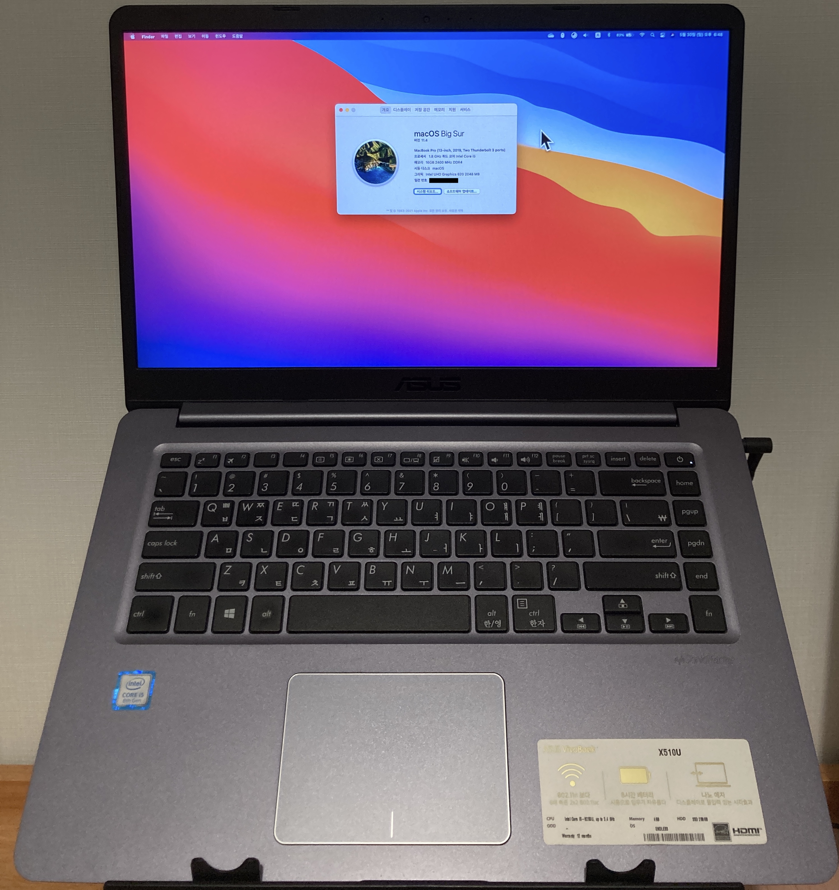

# Asus Vivobook X510UA-BQ490 해킨토시

## 시스템 상세정보

| Item | Details |
| - | - |
| Model | Asus Vivobook X510UA-BQ490 |
| CPU | Intel Core i5-8250U |
| Graphics | Intel UHD Graphics 620 |
| RAM | Samsung 8GB x 2 2400 MHz DDR4 SODIMM *(upgraded)* |
| Wi-Fi / Bluetooth | BCM94360NG / BCM20702 *(Replaced)* |
| Card Reader | Alcor Micro USB Card Reader connected via USB |
| Camera | ASUS UVC HD |
| Audio | Conexant CX8050 |
| Touchpad | ELAN1200 |
| UEFI BIOS Utility | X510UAR-AS.310 |

## 미작동

1. hieplpvip의 FN + media 컨트롤 키에 해당하는 패치가 이 노트북에는 적용되지 않습니다.
2. IMEI 펌웨어가 macOS와 호환되지 않는 부분이 있어 DRM 콘텐츠 지원이 미비합니다. [DRM Compatibility Chart](https://github.com/acidanthera/WhateverGreen/blob/master/Manual/FAQ.Chart.md).

## 필독 사항

1. 이 fork는 X510UA-BQ490에 최적화되도록 구성했습니다. 만약 본인의 노트북에 옵티머스 외장그래픽이 없고 키보드 백라이트가 없다면 사용할 수 있지만, 책임은 본인에게 있습니다. 부담이 되거나 외장그래픽 기능을 제어해야 한다면 [hieplpvip의 Zenbook repository](https://github.com/hieplpvip/Asus-Zenbook-Hackintosh)와 [S510UA hackintosh repository](https://github.com/LeeBinder/Asus-Vivobook-S510UA-Hackintosh)를 참고하시길 바랍니다.
2. 이 README를 꼭 숙지하고 진행하시기 바랍니다. [여기서 제공되는 것과 상관 없는 내용 및 아무 조치 없이 아무 말이나 한다면 무시됩니다](https://github.com/whatnameisit/Asus-Vivobook-X510UA-BQ490-Hackintosh/issues/10#issuecomment-622947888).

## 설치 방법

1. [Configuration.pdf](https://github.com/acidanthera/OpenCorePkg/blob/master/Docs/Configuration.pdf)를 정독합니다.
2. [Dortania guides](https://dortania.github.io/getting-started/)를 정독합니다.
3. macOS 인스톨러 USB를 준비합니다.
4. USB의 EFI 파티션에 OC와 BOOT 폴더를 붙여넣으습니다.
5. USB로 부팅해서 macOS Installer를 선택한 후 설치합니다.
6. SSD의 EFI 파티션을 마운트한 후 USB EFI를 SSD의 EFI로 붙여넣습니다.
7. SMBIOS의 시리얼 숫자들을 새로 생성하십시오.
- Note: 경우에 따라서 별도 패치가 필요할 수 있습니다.
    - 잠자기와 비행기모드 fn 버튼이 있을 때 -- [잠자기와 에어플레인 모드 fn 키 활성화](#잠자기와-에어플레인-모드-fn-키-활성화)
    - 전력관리를 최대 활성화하고자 하는 경우 -- [MSR 0xE2 (CFG Lock) 해제](#mrs-0xe2-cfg-lock-해제)
    
## 잠자기와 에어플레인 모드 fn 키 활성화

1. [AsusSMC](https://github.com/hieplpvip/AsusSMC/releases)를 다운로드합니다.
2. install_daemon.sh를 터미널로 드래그해서 실행시키십시오.

## MSR 0xE2 (CFG Lock) 해제

1. [Dortania 가이드](https://dortania.github.io/OpenCore-Post-Install/misc/msr-lock.html)를 참고하십시오.
- Note: 자신의 노트북의 바이오스 버전을 확실히 알아야 합니다. 버전이 다르다면 노트북에 이상이 생길 수 있습니다. 혹은 OpenCore에서 제공되는 ControlMsrE2.efi를 사용해볼 수도 있습니다. 어떤 결정을 하던지 책임은 본인에게 있습니다.

## 설치 완료 후
 
 1. Configuration.pdf와 Dortania 가이드를 다시 한 번 정독하십시오.

## Acknowledgment

Apple for macOS

tctien342 and hieplpvip for Asus repositories

The VoodooI2C team for working touchpad

daliansky and williambj1 for many hotpatch methods

LeeBinder for many helps

fewtarius for new CPUFriendDataProvider.kext and SMBIOS

The Acidanthera team for OpenCore and many kexts

The Dortania team for OpenCore guides
